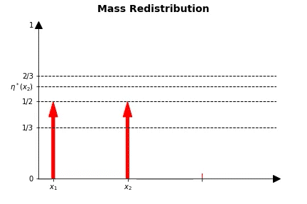

# (ƒ , $\Gamma$)-Divergence

# Mass Redistribution/Transfer Demo
## Dirac Masses

 Case 1                       |  Case 2            
-----------------------------:|:----------------------------
|

## Gaussian

