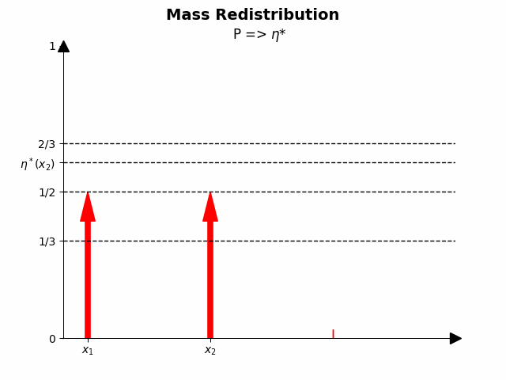
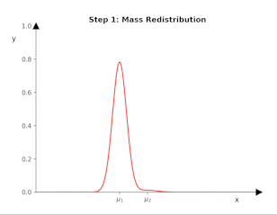
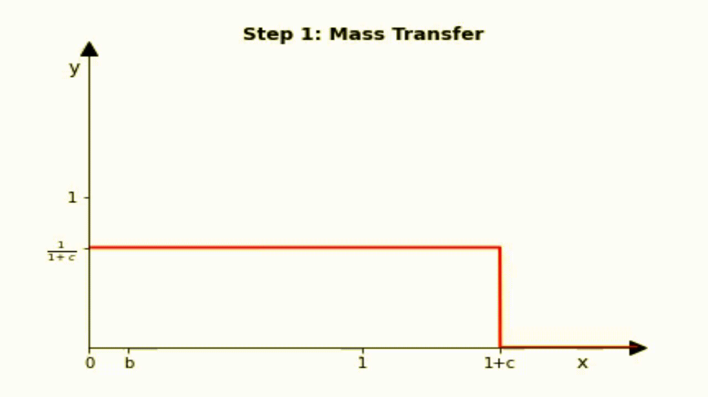

Under Construction
# (ƒ , $\Gamma$)-Divergence

# Mass Redistribution/Transfer Demo
## Dirac Masses

Case 1                        |  Case 2            
-----------------------------:|:----------------------------
|

## Gaussian

## Uniform

